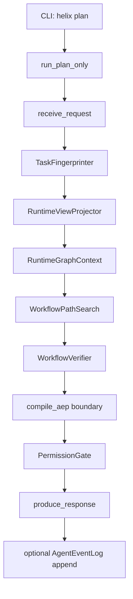
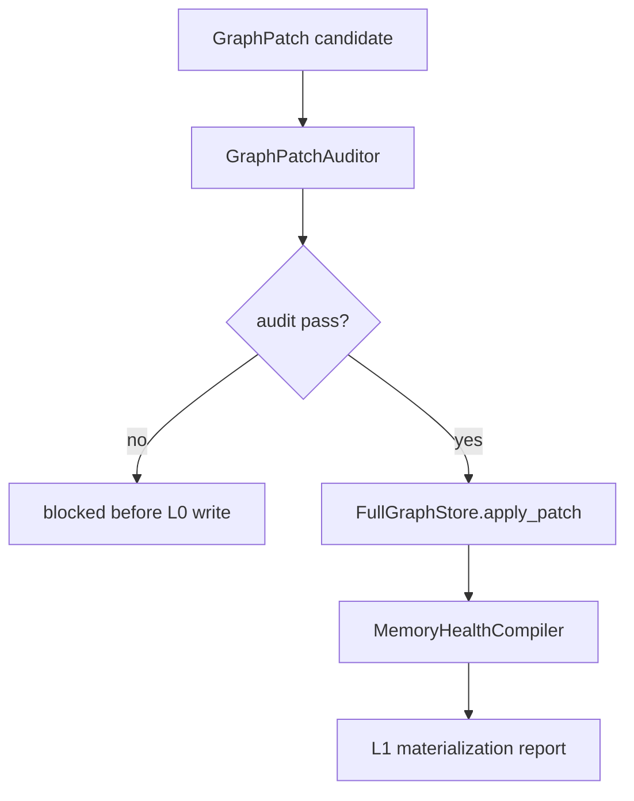
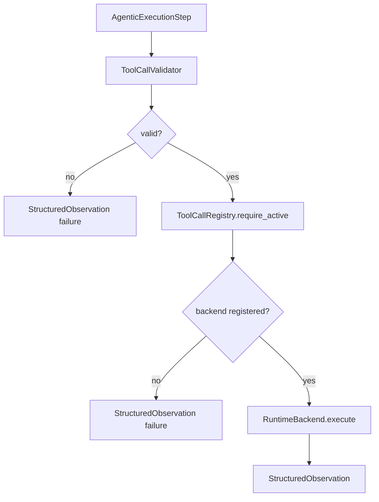
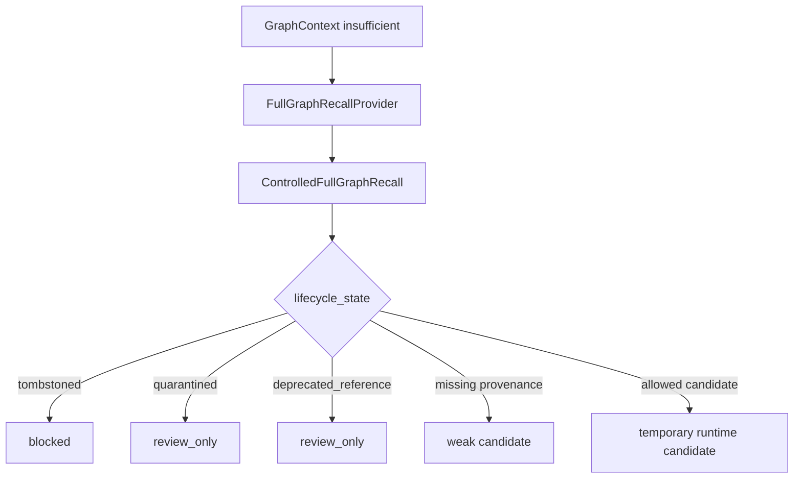

# HELIX Current Implementation Overview

This document describes the current code structure and runtime logic in `D:\workspace\HELIX`.

Source architecture: `E:\donwloads\HELIX_architecture_v7.md`

## Current Position

HELIX is currently implemented as a Python package with a plan-only runnable agent flow plus explicit boundaries for graph construction, ToolCall execution, graph patching, memory health compilation, controlled recall, hooks, and self-evolution.

The code intentionally does not contain real bioinformatics tools, fake L0 graph data, fake L1 healthy graph data, or fake database adapters. Those must enter later through real `ToolCallSpec`, audited `GraphPatch`, L0 storage, and `MemoryHealthCompiler`.

## Are There Multiple Agents?

At the current code level, there is one HELIX agent system.

The code contains multiple workflows and modules, not multiple independent agents:

- `plan-only orchestration`: the current runnable agent flow.
- `graph-construction bootstrap workflow`: bootstrap mode for HELIX's existing graph-construction path.
- `capability evolution`: controlled candidate-tool/candidate-workflow path.
- `memory evolution`: failure-to-constraint extraction path.

These are internal workflows or module boundaries. They are not extra architectural agents.

## Top-Level Module Map

```text
src/helix/
  app/
  capability_evolution/
  config/
  core/
  graph/
  graph_construction/
  graph_health/
  graph_patch/
  hooks/
  memory/
  orchestration/
  permissions/
  planning/
  projection/
  runtime/
  schemas/
  toolcall/
  verification/
```

## Module Responsibilities

### `app`

CLI entrypoints.

Current command:

```powershell
uv run helix plan "Plan RNA-seq QC workflow"
```

Optional event log:

```powershell
uv run helix plan "Plan RNA-seq QC workflow" --event-log D:\workspace\codex\logs\2026-05-21\events.jsonl
```

### `config`

External configuration loading.

Current config files live under:

```text
config/
  base.yaml
  dev.yaml
  graph_health.yaml
  logging.yaml
  permissions.yaml
  tool_registry.yaml
  prompts/task_fingerprint.md
```

### `schemas`

Shared Pydantic contracts. This is the central object contract layer.

Important schemas:

- `TaskFingerprint`
- `RuntimeGraphContext`
- `GraphContextSufficiencyReport`
- `AgenticExecutionPlan`
- `AgenticExecutionStep`
- `ToolCallSpec`
- `StructuredObservation`
- `WorkflowAuditReport`
- `ClaimAuditReport`
- `GraphPatch`
- `LifecycleTransition`
- `ExperienceCandidate`
- `Constraint`

### `core`

Core services.

Currently contains:

- `TaskFingerprinter`

The current fingerprinter is conservative. It creates a valid `TaskFingerprint` and records unknown domain fields in `ambiguity_items` instead of guessing.

### `orchestration`

LangGraph-based runtime orchestration.

Current runnable flow:

- `run_plan_only`
- `build_plan_only_graph`
- `PlanOnlyState`

This is currently the main agent path.

### `projection`

Runtime graph context projection and controlled L0 recall.

Current components:

- `RuntimeViewProjector`
- `GraphContextSufficiencyChecker`
- `ControlledFullGraphRecall`
- `FullGraphRecallProvider`
- `FullGraphRecallCandidate`

No real L0/L1 database is connected yet. Without L1, projection returns an insufficient-context report.

### `planning`

Planning boundaries.

Current components:

- `WorkflowPathSearch`
- `WorkflowSearchResult`
- `ExitPlanGate`

Current path search does not hallucinate domain workflows. If context is insufficient, it returns unresolved requirements.

### `verification`

Verification boundaries.

Current components:

- `WorkflowVerifier`
- `ClaimVerifier`

`ClaimVerifier` returns `not_applicable` when there are no claims and `unsupported` for claims without evidence.

### `permissions`

Execution permission checks.

Current component:

- `PermissionGate`

Current behavior:

- blocked workflow reports deny execution,
- `plan_only` mode denies tool execution,
- no unsafe fallback execution.

### `toolcall`

ToolCall execution boundary.

Current components:

- `ToolCallRegistry`
- `ToolCallValidator`
- `ToolCallDispatcher`
- `RuntimeBackend` protocol

Current behavior:

- unregistered tools fail,
- candidate ToolCallSpec records are not active,
- missing required bindings fail,
- missing runtime backend fails closed with `StructuredObservation`.

### `runtime`

Runtime facts and session control.

Current components:

- `AgentEventLog`
- `FileAgentEventLog`
- `AgentEvent`
- `SessionStateMachine`

Event logs are append-only JSONL.

### `hooks`

Lifecycle hook bus.

Current components:

- `HookBus`
- `HookEvent`
- `HookOutput`

Hooks can emit warnings, audit records, and GraphPatch candidate references. Hooks cannot directly write L1.

### `graph`

Graph store boundaries and graph-tier policy.

Current components:

- `FullGraphStore`
- `HealthyGraphStore`
- `GraphTierPolicy`

There is no concrete graph database adapter yet. That is intentional.

### `graph_patch`

Graph write control.

Current components:

- `GraphPatchBuilder`
- `GraphPatchValidator`
- `GraphPatchAuditor`

Current checks include:

- GraphPatch targets L0 only,
- source event ids are required,
- node and edge mutations need ids,
- lifecycle transitions must be valid,
- high-risk patches warn if not approved.

### `graph_health`

Memory health compilation and lifecycle policy.

Current components:

- `MemoryHealthCompiler`
- `LifecycleStateManager`

Lifecycle transitions include:

```text
candidate -> probationary -> active_warm -> active_hot
candidate/probationary/active/cold_reference -> quarantined -> retired -> tombstoned
```

### `graph_construction`

Bootstrap mode for HELIX's existing graph-construction workflow.

Current component:

- `GraphConstructionBootstrapWorkflow`

This is not a new agent. It composes:

```text
GraphPatch
  -> GraphPatchAuditor
  -> FullGraphStore.apply_patch(...)
  -> MemoryHealthCompiler.compile(...)
```

It exists so the first L0/L1 build can use the same audited path once a real database adapter is installed.

### `capability_evolution`

Controlled new capability path.

Current components:

- `CandidateTool`
- `CandidateWorkflow`
- `ToolCallSpecBuilder`

Candidate tools/workflows cannot be created directly as active capabilities.

### `memory`

Experience and memory consolidation boundaries.

Current component:

- `FailureToConstraintExtractor`

Current behavior:

- failed ToolCall events can become candidate warning constraints,
- a single failure cannot become a global blocker constraint.

## Current Plan-Only Internal Flow



Because no L1 healthy graph and no active ToolCallSpec exist yet, the expected current result is:

```text
status: plan_blocked
blockers:
  - NO_WORKFLOW_PATH
  - NO_TOOLCALL_SPEC
```

That is correct behavior. The agent is refusing to invent workflows or tools.

## Current Graph Construction Bootstrap Flow



This is the code representation of the first full graph build path. It waits for a real `FullGraphStore` implementation.

## Current ToolCall Flow



No real bioinformatics backend exists yet.

## Current Controlled Recall Flow



The provider is a protocol for future L0 database adapters.

## Current Event Logging

When `--event-log` is provided, plan-only runs append:

```text
UserRequestReceived
PlanModeEntered
TaskFingerprinted
RuntimeGraphContextProjected
WorkflowPathSelected
WorkflowVerified
PermissionChecked
```

The log is append-only JSONL.

## Current Tests

Current validation command:

```powershell
uv run pytest
uv run ruff check .
uv run mypy
```

Latest known result:

```text
72 passed
ruff passed
mypy passed
```

## What Is Still Missing

The following architecture pieces are not fully implemented yet:

- `ParameterSourceChecker`
- deterministic workflow ranking tuple
- `ResultSanityChecker`
- `EvidenceChecker`
- `PreferenceConsolidator`
- `ExperienceReplay`
- `FailurePatternMiner`
- `WorkflowPatternMiner`
- `QualityExperienceUpdater`
- `CapabilityGapDetector`
- `WorkflowCandidateBuilder`
- `CapabilityPromotion`
- concrete graph database adapters
- concrete runtime backend adapters
- API service endpoints
- real bioinformatics tool specs and workflows
- real L0/L1 graph data

## Practical Summary

Current HELIX can:

- load config,
- run a LangGraph plan-only flow,
- produce structured blocked plans,
- write append-only event logs,
- validate ToolCall contracts,
- reject unsafe or unregistered execution,
- audit GraphPatch writes,
- model graph construction bootstrap,
- model controlled full graph recall,
- model lifecycle transitions,
- extract candidate constraints from failures,
- prevent fake active tools or fake global hard rules.

Current HELIX cannot yet:

- execute real bioinformatics tools,
- query a real graph database,
- build a real L1 healthy graph,
- produce a domain-specific workflow from real evidence.

Those missing parts require the real database, real graph content, and real ToolCallSpec installation.
