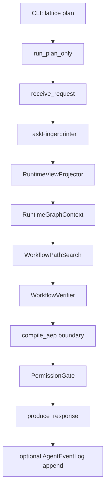
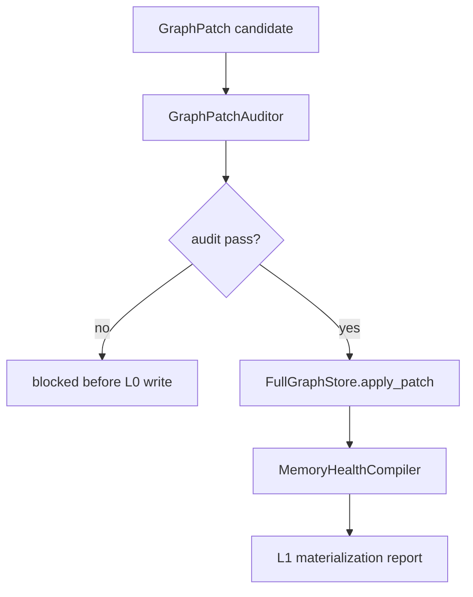
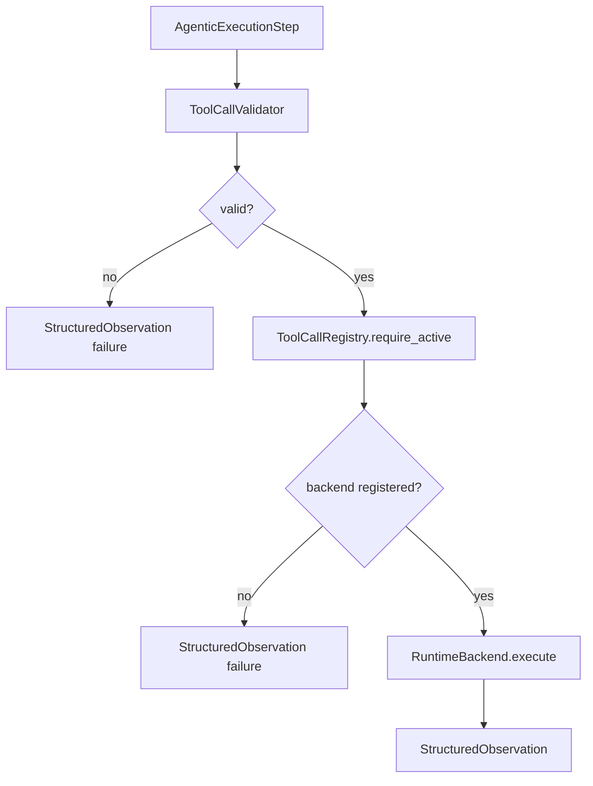
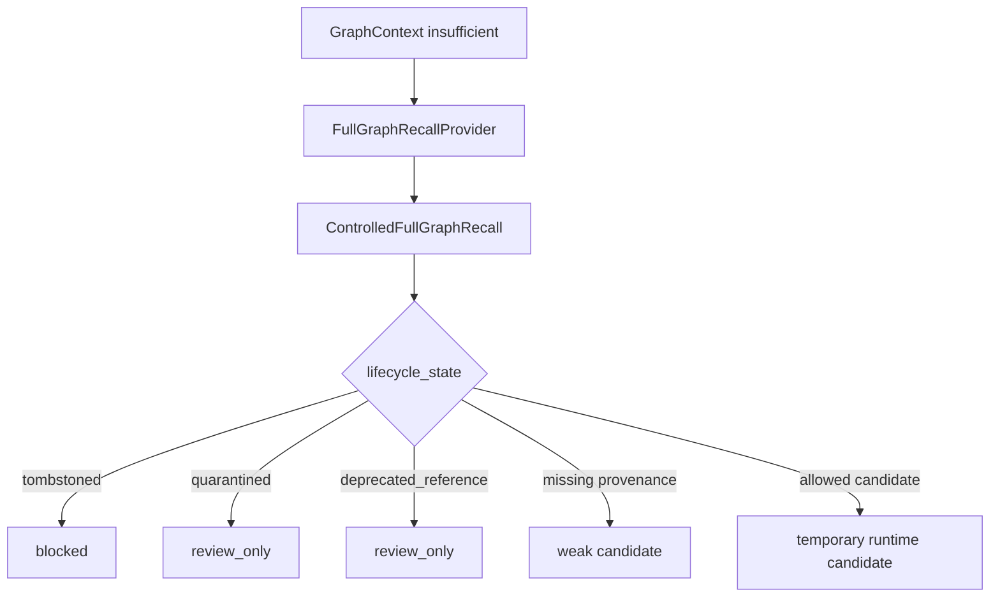

# LATTICE 当前代码实现说明

本文档说明 `D:\workspace\LATTICE` 当前代码结构、内部流程、模块职责，以及现在已经实现和仍未实现的部分。

设计依据：用户提供的 LATTICE 架构规划文档。

## 当前定位

当前 LATTICE 已经是一个 Python 包，具备一个可运行的 `plan-only` agent 主流程，并且已经预留了图构建、ToolCall 执行、GraphPatch 写入、MemoryHealthCompiler、Controlled Full Graph Recall、HookBus、自进化、demo/production graph profile 等核心边界。

代码里刻意没有加入真实生物信息学工具、假 L0 图数据、假 L1 healthy graph 数据或假数据库 adapter。正式模式下，它们必须通过真实 `ToolCallSpec`、经过审计的 `GraphPatch`、L0 存储和 `MemoryHealthCompiler` 进入系统。demo 模式下，系统只读取外部手动构建并随系统打包的 demoL0/demoL1 图资产，不启动 builder、evolution 或 GraphPatch 写入。demoL0、demoL1 和正式 L0/L1 共用同一套六层异构图 schema。

## 现在有几个 Agent？

当前代码层面只有一个 LATTICE agent 系统。

代码里有多个 workflow 和模块，但不是多个独立 agent：

- `plan-only orchestration`：当前可运行的 agent 主流程。
- `graph-construction bootstrap workflow`：LATTICE 既有图构建路径的 bootstrap 模式。
- `capability evolution`：受控的新工具 / 新 workflow 候选能力扩展路径。
- `memory evolution`：从失败事件提取 constraint 的经验演化路径。

这些都是 LATTICE 内部 workflow 或模块边界，不是额外新增的架构外 agent。

## 顶层模块结构

```text
src/lattice/
  app/
  capability_evolution/
  config/
  core/
  graph/
  graph_construction/
  graph_health/
  graph_patch/
  hooks/
  memory/
  orchestration/
  permissions/
  planning/
  projection/
  runtime/
  schemas/
  toolcall/
  verification/
```

## 模块职责

### `app`

应用入口。

当前已有 CLI 命令入口：`lattice plan`。

具体任务文本应来自真实用户请求；本文档不固化示例实验或示例工作流。可选事件日志通过 `--event-log` 写入指定 JSONL 文件。

### `config`

外置配置加载。

当前配置文件：

```text
config/
  base.yaml
  dev.yaml
  graph_health.yaml
  logging.yaml
  permissions.yaml
  tool_registry.yaml
  prompts/task_fingerprint.md
```

重要参数后续应继续放在 `config/`，不要硬编码到业务代码里。

### `schemas`

共享对象契约层。系统中跨模块传递的核心对象都在这里定义。

当前重要 schema：

- `TaskFingerprint`
- `RuntimeGraphContext`
- `GraphContextSufficiencyReport`
- `AgenticExecutionPlan`
- `AgenticExecutionStep`
- `ToolCallSpec`
- `StructuredObservation`
- `WorkflowAuditReport`
- `ClaimAuditReport`
- `GraphPatch`
- `LifecycleTransition`
- `ExperienceCandidate`
- `Constraint`

### `core`

核心服务层。

当前包含：

- `TaskFingerprinter`

当前的 fingerprinter 是保守实现：它生成合法的 `TaskFingerprint`，但不会硬猜生信任务分类。未知字段会进入 `ambiguity_items`。

### `orchestration`

LangGraph 编排层。

当前主流程：

- `run_plan_only`
- `build_plan_only_graph`
- `PlanOnlyState`

这是当前唯一可运行的 agent 主链路。

### `projection`

运行时图上下文投影和受控 L0 召回。

当前组件：

- `RuntimeViewProjector`
- `GraphContextSufficiencyChecker`
- `ControlledFullGraphRecall`
- `FullGraphRecallProvider`
- `FullGraphRecallCandidate`

目前还没有真实 L0/L1 数据库，所以 projector 会返回 `insufficient` 的 runtime context，而不是编造上下文。

### `planning`

规划边界层。

当前组件：

- `WorkflowPathSearch`
- `WorkflowSearchResult`
- `ExitPlanGate`

当前 workflow search 不会生成假的生信 workflow。上下文不足时，它会返回 unresolved requirements。

### `verification`

校验层。

当前组件：

- `WorkflowVerifier`
- `ClaimVerifier`

`ClaimVerifier` 当前行为：

- 没有 claim 时返回 `not_applicable`
- 有 claim 但没有证据时返回 `unsupported`

### `permissions`

权限和执行边界。

当前组件：

- `PermissionGate`

当前行为：

- workflow 被阻断时不允许执行
- `plan_only` 模式不允许工具执行
- 没有不安全 fallback

### `toolcall`

ToolCall 执行边界。

当前组件：

- `ToolCallRegistry`
- `ToolCallValidator`
- `ToolCallDispatcher`
- `RuntimeBackend` protocol

当前行为：

- 未注册工具会失败
- candidate 状态的 `ToolCallSpec` 不能作为 active 工具执行
- 缺少必需输入或参数绑定会失败
- 没有 runtime backend 时 fail closed，并返回结构化 `StructuredObservation`

### `runtime`

运行时事实源和状态控制。

当前组件：

- `AgentEventLog`
- `FileAgentEventLog`
- `AgentEvent`
- `SessionStateMachine`

事件日志是 append-only JSONL。

### `hooks`

生命周期 hook 总线。

当前组件：

- `HookBus`
- `HookEvent`
- `HookOutput`

Hook 可以产出 warning、audit record、GraphPatch candidate 引用。Hook 不能直接写 L1。

### `graph`

图谱存储边界和图层策略。

当前组件：

- `FullGraphStore`
- `HealthyGraphStore`
- `GraphTierPolicy`
- `GraphProfile`
- `GraphProfileRegistry`
- `JsonlPackagedDemoGraphStoreLoader`
- `BioEvoKGNode`
- `BioEvoKGEdge`
- `BioEvoKGGraphRecords`
- `OperationalProfile`

当前还没有具体图数据库 adapter，这是有意保留的。demoL0/demoL1 已经预留 packaged JSONL 图资产加载边界，正式数据库 adapter 后续仍走同一组 store port。

六层异构图 schema 已经覆盖：

- Task Layer
- Evidence Layer
- Workflow Layer
- Resource Layer
- Implementation Layer
- Experience / Feedback / Failure / Preference Layer

节点必须声明 `layer`、`node_type`、`lifecycle_state` 和 `provenance`。边必须声明 `edge_type`、source/target node id、source/target layer、`source_type`、`lifecycle_state` 和 `provenance`。L1 图记录可以强制 `OperationalProfile` 和 healthy lifecycle state。

### `graph_patch`

图谱写入控制。

当前组件：

- `GraphPatchBuilder`
- `GraphPatchValidator`
- `GraphPatchAuditor`

当前检查包括：

- GraphPatch 只能指向 L0
- 必须有关联 source event
- node / edge mutation 必须有 id
- lifecycle transition 必须合法
- high-risk patch 未批准时给 warning

### `graph_health`

图谱健康化编译和生命周期策略。

当前组件：

- `MemoryHealthCompiler`
- `LifecycleStateManager`

当前生命周期路径：

```text
candidate -> probationary -> active_warm -> active_hot
candidate/probationary/active/cold_reference -> quarantined -> retired -> tombstoned
```

### `graph_construction`

LATTICE 既有图构建 workflow 的 bootstrap 模式。

当前组件：

- `GraphConstructionBootstrapWorkflow`

注意：这不是新 agent。

它串联的是：

```text
GraphPatch
  -> GraphPatchAuditor
  -> FullGraphStore.apply_patch(...)
  -> MemoryHealthCompiler.compile(...)
```

它的作用是：等真实数据库 adapter 接入后，第一次完整构建 L0/L1 时可以走同一套受控写入路径。

### `capability_evolution`

受控能力扩展路径。

当前组件：

- `CandidateTool`
- `CandidateWorkflow`
- `ToolCallSpecBuilder`

候选工具 / workflow 不能直接创建成 active 状态。

### `memory`

经验层和记忆沉淀边界。

当前组件：

- `FailureToConstraintExtractor`

当前行为：

- 失败的 ToolCall event 可以变成 candidate warning constraint
- 单次失败不能直接变成 global blocker constraint

## 当前 Plan-Only 内部流程



因为现在没有 L1 healthy graph，也没有 active `ToolCallSpec`，所以当前预期输出是：

```text
status: plan_blocked
blockers:
  - NO_WORKFLOW_PATH
  - NO_TOOLCALL_SPEC
```

这是正确行为。系统拒绝编造 workflow 或工具。

## 当前图构建 Bootstrap 流程



这就是第一次完整图构建路径的代码表达。它等待真实 `FullGraphStore` 实现。

## 当前 ToolCall 流程



当前没有真实生物信息学 backend。

## 当前 Controlled Recall 流程



`FullGraphRecallProvider` 是未来 L0 数据库 adapter 的接口。

## 当前事件日志

如果提供 `--event-log`，plan-only 运行会 append：

```text
UserRequestReceived
PlanModeEntered
TaskFingerprinted
RuntimeGraphContextProjected
WorkflowPathSelected
WorkflowVerified
PermissionChecked
```

日志格式是 append-only JSONL。

## 当前测试

验证命令：

```powershell
uv run pytest
uv run ruff check .
uv run mypy
```

最近结果：

```text
72 passed
ruff passed
mypy passed
```

## 仍未实现的部分

以下架构内容还没有完整实现：

- `ParameterSourceChecker`
- deterministic workflow ranking tuple
- `ResultSanityChecker`
- `EvidenceChecker`
- `PreferenceConsolidator`
- `ExperienceReplay`
- `FailurePatternMiner`
- `WorkflowPatternMiner`
- `QualityExperienceUpdater`
- `CapabilityGapDetector`
- `WorkflowCandidateBuilder`
- `CapabilityPromotion`
- 具体图数据库 adapter
- 具体 runtime backend adapter
- API service endpoints
- 真实生物信息学 ToolCallSpec、workflow、evidence、resource 数据
- 真实 L0/L1 图数据

## 实用总结

当前 LATTICE 已经可以：

- 加载配置
- 运行 LangGraph plan-only 主流程
- 输出结构化 blocked plan
- 写 append-only event log
- 校验 ToolCall 契约
- 拒绝不安全或未注册工具执行
- 审计 GraphPatch 写入
- 表达图构建 bootstrap 流程
- 表达 controlled full graph recall
- 表达生命周期状态流转
- 从失败事件提取 candidate constraint
- 防止假的 active tool 或假的 global hard rule

当前 LATTICE 还不能：

- 执行真实生物信息学工具
- 查询真实图数据库
- 构建真实 L1 healthy graph
- 基于真实证据输出领域 workflow

这些缺失部分需要真实数据库、真实图内容和真实 `ToolCallSpec` 安装后继续接入。
